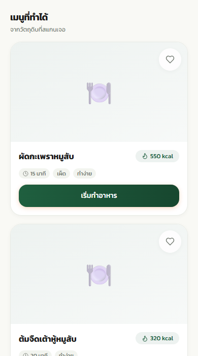
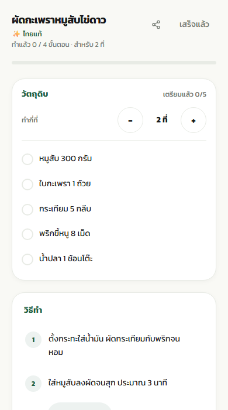

<div align="center">

# 🍳 Chef Kub — สแกนวัตถุดิบ แนะนำสูตรอาหาร 🥘

*📸 ถ่ายรูปวัตถุดิบ → 🤖 AI แนะนำเมนู → 👨‍🍳 ลงมือทำ*

🥕 🍅 🧄 🧅 🥚 🌶️ 🥬 🍆 🐟 🍗

</div>

---

โปรเจกต์จบที่ใช้ **🧠 Computer Vision + ✨ Generative AI** ช่วยผู้ใช้สแกนวัตถุดิบจากรูปภาพ แนะนำสูตรอาหาร และจำ label ที่ผู้ใช้เคยแก้ไว้ใน Cloudflare D1 — เจอรูปเดิมหรือรูปที่**คล้ายกัน**ก็โหลด label เดิมได้ทันทีโดยไม่ต้องสแกนซ้ำ

การตรวจจับใช้ **⚡ YOLO เดาในเบราว์เซอร์ แล้วให้ 🔮 Gemini เป็นคนตัดสินสุดท้าย** — YOLO เร็วแต่ "มั่นใจแต่มั่ว" ได้ Gemini จึงยืนยันของที่เดาถูกและเติมของที่ YOLO พลาด

## 📸 หน้าตาแอป

<div align="center">
<table>
<tr>
<td width="50%" align="center">

<br /><b>🍲 เมนูที่ทำได้</b><br />
<sub>สูตรที่ AI จัดให้จากวัตถุดิบที่สแกนเจอ<br />พร้อมแคลอรี่ เวลา และแท็กประจำเมนู</sub>
</td>
<td width="50%" align="center">

<br /><b>👨‍🍳 โหมดทำครัว</b><br />
<sub>ปรับจำนวนที่แล้วปริมาณสเกลตาม<br />ติ๊กวัตถุดิบที่เตรียมแล้ว ทำตามขั้นตอนทีละสเต็ป</sub>
</td>
</tr>
</table>
</div>

## ✨ ฟีเจอร์หลัก

### 🔍 สแกน & ตรวจจับ

| ฟีเจอร์ | รายละเอียด |
|---------|------------|
| 📷 ตรวจจับวัตถุดิบ (YOLO) | YOLO11n (~122 class) รันในเบราว์เซอร์ด้วย TensorFlow.js |
| 🔮 ตัดสินด้วย Gemini | Gemini ดูรูปจริง ยืนยันของที่ YOLO เดาถูก + เติมของที่ YOLO พลาด (source: `yolo` / `gemini` / `manual`) |
| 🔎 จำรูปเดิม + รูปคล้าย | SHA-256 จับรูปเดิมเป๊ะ ๆ / dHash + Hamming distance จับรูปคล้ายกัน |
| ✏️ แก้ไข / Label ด้วยมือ | วาดกรอบ เลือกชื่อจากรายการ หรือเพิ่ม class ใหม่ |
| 💾 จำ Label | บันทึก bounding box (YOLO format) ลง Cloudflare D1 |
| 🗂️ เก็บรูปเป็น training data | อัพรูปขึ้น Cloudflare R2 ตอน label เพื่อใช้ train โมเดลรอบต่อไป (ถ้าไม่ตั้งค่า R2 ก็ยังเซฟ label ได้) |
| 🏷️ จัดการ Class | ตาราง `classes` กลาง ป้องกันชื่อซ้ำ/คล้ายกัน |

### 🍲 สูตรอาหาร

| ฟีเจอร์ | รายละเอียด |
|---------|------------|
| 🍜 สร้างสูตรอาหาร | Gemini สร้าง 3 เมนูจากวัตถุดิบที่มี เรียงจากเมนูที่เสร็จเร็วที่สุด |
| 🎭 โหมดทำอาหาร | ปกติ / ฟิวชั่น / จากอนิเมะ — แต่ละโหมดปรับสไตล์เมนู + สไตล์รูป |
| 🖼️ รูปประกอบเมนู | Cloudflare Workers AI (`flux-1-schnell`) สร้างรูปจากคำบรรยายเมนู (โฟโต้ / ภาพวาด) |
| ⭐ รายการโปรด / ประวัติ | เก็บใน localStorage |

### 👨‍🍳 โหมดทำครัว

| ฟีเจอร์ | รายละเอียด |
|---------|------------|
| 🔊 อ่านขั้นตอนให้ฟัง | แสดงทีละ step + อ่านออกเสียง (Web Speech API) |
| 🍽️ ปรับจำนวนที่ | เพิ่ม/ลดจำนวนที่ แล้วปริมาณวัตถุดิบสเกลตามอัตโนมัติ |
| ✅ Checklist วัตถุดิบ | ติ๊กของที่เตรียมแล้ว เห็นความคืบหน้า (เตรียมแล้ว 3/5) |
| ⏱️ จับเวลาขั้นตอน | อ่านเวลาจากข้อความขั้นตอนเอง (เช่น "ผัดไฟกลาง 3 นาที") แล้วตั้งเวลาให้ |
| 📱 กันจอดับ | Wake Lock API — จอไม่ดับระหว่างทำอาหาร |
| 📤 แชร์สูตร | แชร์เป็นข้อความ หรือการ์ดรูป (feed 1:1 / story 9:16) |
| 🌟 ให้ดาวเมนูที่ทำแล้ว | บันทึกคะแนน 1–5 ดาวลง localStorage |

## 🏗️ สถาปัตยกรรมระบบ

```
┌─────────────┐     ┌──────────────────────────────────────────┐
│  ผู้ใช้      │────▶│  Frontend (Next.js + React)              │
│  ถ่ายรูป/    │     │  • กล้อง / อัปโหลด                       │
│  อัปโหลด     │     │  • Gallery + แก้ไข label                 │
└─────────────┘     └──────────────┬───────────────────────────┘
                                   │
     ┌──────────────┬──────────────┼──────────────┬──────────────┐
     ▼              ▼              ▼              ▼              ▼
┌─────────┐   ┌──────────┐   ┌──────────┐   ┌──────────┐   ┌──────────┐
│ YOLO11n │──▶│ Gemini   │   │ D1       │   │ R2       │   │ Workers  │
│ (TF.js) │   │ ตัดสิน   │   │ (SQLite) │   │ เก็บรูป  │   │ AI (รูป) │
│ เดาในเบรา│   │ ภาพจริง  │   │ label    │   │ training │   │ flux     │
└─────────┘   └──────────┘   └──────────┘   └──────────┘   └──────────┘
        user แก้ label → เก็บ hash + annotations ลง D1, รูปขึ้น R2
        เจอรูปเดิม/คล้ายกัน → โหลด label เดิม (ข้าม YOLO + Gemini)
```

## 🔄 Flow สแกนรูป

```
อัปรูป
  → แคชใน memory? → แสดงทันที
  → hash รูป (SHA-256 + dHash)
      → เจอเป๊ะใน DB? → โหลด label (ข้ามการตรวจจับ)
      → เจอรูปคล้ายกัน (Hamming ≤ 8)? → โหลด label เดิม (ข้ามการตรวจจับ)
  → ไม่เจอ → YOLO เดาในเบราว์เซอร์ → ส่ง label ที่เดา + รูป ให้ Gemini ตัดสิน
      → Gemini คืน confirmed (ของที่ YOLO เดาถูก) + added (ของที่ YOLO พลาด)
      → กรอบที่ Gemini ไม่ยืนยัน = ของมั่ว ตัดทิ้ง
  → user กด "แก้ไข" → วาดกรอบ / เลือกชื่อ → กด "เสร็จสิ้น"
  → บันทึก hash + annotations ลง D1 และอัพรูปขึ้น R2
```

> 💡 หน้าแกลเลอรีแสดงแค่ **รายการวัตถุดิบ** ไม่โชว์กรอบทับรูป เพื่อไม่ให้ผู้ใช้ทั่วไปสับสน — กรอบจะเห็นเฉพาะในหน้า **แก้ไข** ที่ตั้งใจเข้าไปช่วย label

## 🧰 Tech Stack

- ⚛️ **Frontend:** Next.js 16, React 19, Tailwind CSS 4
- 🎯 **Object Detection:** YOLO11n → TensorFlow.js Graph Model (`public/model/`)
- 🔮 **AI ตัดสินภาพ + สร้างสูตร:** Google Gemini (`gemini-3.1-flash-lite`)
- 🗄️ **Database:** Cloudflare D1 (SQLite) — เก็บ label memory
- 🪣 **Object Storage:** Cloudflare R2 — เก็บไฟล์รูปที่ label แล้วไว้เป็น training data
- 🎨 **Image API:** Cloudflare Workers AI — รูปเมนู (`@cf/black-forest-labs/flux-1-schnell`)
- 🔌 **SDK:** `@google/genai` (D1 / R2 / Workers AI เรียกผ่าน Cloudflare REST API ตรง ๆ)

## 📁 โครงสร้างโปรเจกต์

```
app/
├── actions/                    # Server Actions
│   ├── detectIngredients.ts    # Gemini ตัดสินภาพจาก label ที่ YOLO เดามา
│   ├── generateRecipe.ts       # Gemini สร้างสูตร (ตามโหมดทำอาหาร)
│   ├── generateRecipeImage.ts  # Workers AI สร้างรูปเมนู (โฟโต้ / ภาพวาด)
│   ├── saveLabeledImage.ts     # บันทึก hash + annotations ลง D1, อัพรูปขึ้น R2
│   ├── getLabeledImage.ts      # หา label จากรูปเดิม (SHA-256) หรือรูปคล้าย (dHash)
│   └── classes.ts              # รายการ class + เพิ่มชื่อใหม่ (seed จาก labelsTh.ts)
├── hooks/
│   ├── useChefKub.ts           # state หลักของแอป
│   ├── useYoloModel.ts         # โหลดโมเดล YOLO
│   └── useWakeLock.ts          # กันจอดับระหว่างทำอาหาร
├── components/
│   ├── LabelPickerModal.tsx    # เลือก/เพิ่มชื่อวัตถุดิบ
│   ├── StepTimer.tsx           # จับเวลาขั้นตอนทำอาหาร
│   ├── ShareSheet.tsx          # แชร์สูตร (ข้อความ / การ์ดรูป)
│   ├── Portal.tsx              # render modal นอก DOM tree หลัก
│   ├── RecipeCard / RecipeHeroCard / RecipeCompactCard
│   └── views/                  # Home, Camera, Edit, Recipes, Cook, Favorites
├── lib/
│   ├── yolo/runYoloDetection.ts
│   └── cloudflare/
│       ├── d1.ts               # query D1 ผ่าน REST API
│       └── r2.ts               # อัพรูปขึ้น R2 ผ่าน REST API
├── types/                      # recipe.ts, imageResult.ts
└── utils/
    ├── labels.ts / labelsTh.ts   # class ของ YOLO + คำแปลไทย (~122)
    ├── classRegistry.ts          # class list ฝั่ง client
    ├── cookingModes.ts           # โหมดทำอาหาร + tag เมนู + สไตล์รูป
    ├── imageHash.ts              # SHA-256 (รูปเดิมเป๊ะ ๆ)
    ├── perceptualHash.ts         # dHash 64 bit (รูปคล้ายกัน)
    ├── normalizeLabel.ts         # normalize ชื่อ + หาชื่อที่คล้ายกัน
    ├── toYoloBBox.ts             # แปลงพิกัดกรอบ (pixel ↔ YOLO normalized)
    ├── scaleIngredient.ts        # สเกลปริมาณวัตถุดิบตามจำนวนที่
    ├── parseStepDuration.ts      # อ่านเวลาจากข้อความขั้นตอน → ตั้ง timer
    ├── shareRecipe.ts            # แชร์สูตรผ่าน Web Share API
    ├── recipeCard.ts             # วาดการ์ดสูตรเป็นรูป (feed 1:1 / story 9:16)
    └── storage/                  # localStorage (โปรด + ประวัติ + cookLog)

public/model/                   # โมเดล YOLO (model.json + weights + metadata.yaml)
public/shots/                   # ภาพหน้าจอที่ใช้ใน README
```

## 🚀 การติดตั้ง

### 1️⃣ Dependencies

```bash
bun install   # หรือ npm install
```

### 2️⃣ Environment Variables 🔐

สร้างไฟล์ `.env` ที่ root โปรเจกต์:

```env
GEMINI_API_KEY=your_gemini_key
GEMINI_DETECT_API_KEY=your_second_gemini_key

CLOUDFLARE_ACCOUNT_ID=your_account_id
CLOUDFLARE_API_TOKEN=your_api_token
CLOUDFLARE_D1_DATABASE_ID=your_d1_database_id
CLOUDFLARE_R2_BUCKET=your_r2_bucket_name
```

| ตัวแปร | คำอธิบาย |
|--------|----------|
| `GEMINI_API_KEY` | [Google AI Studio](https://aistudio.google.com/apikey) — สร้างสูตร |
| `GEMINI_DETECT_API_KEY` | key ตัวที่ 2 สำหรับตัดสินภาพ (แยกโควตา free tier จากการสร้างสูตร) — ไม่ตั้งก็ได้ จะ fallback ไปใช้ `GEMINI_API_KEY` |
| `CLOUDFLARE_ACCOUNT_ID` | Cloudflare Dashboard → Workers & Pages → Account ID |
| `CLOUDFLARE_API_TOKEN` | API token สิทธิ์ **Workers AI: Read + D1: Edit + R2 Storage: Edit** |
| `CLOUDFLARE_D1_DATABASE_ID` | ได้จากตอนสร้าง DB (`wrangler d1 create`) หรือ Dashboard → D1 |
| `CLOUDFLARE_R2_BUCKET` | ชื่อ bucket R2 สำหรับเก็บรูป training — ถ้าไม่ตั้งจะข้ามการอัพรูป แต่ยังเซฟ label ได้ |

> 💡 **ทำไมต้องมี Gemini 2 key?** free tier จำกัดจำนวน request ต่อวัน**ต่อ project** การแยก key ให้งาน "ตัดสินภาพ" กับ "สร้างสูตร" ทำให้แต่ละงานมีโควตาของตัวเอง ไม่แย่งกัน (ต้องสร้างคนละ Google Cloud project ถึงจะแยกโควตาได้จริง)

### 3️⃣ ตั้งค่า Cloudflare D1 + R2 ☁️

```bash
# สร้าง D1 database — จด database_id ที่ได้ใส่ .env
npx wrangler d1 create chef-kub

# สร้าง R2 bucket สำหรับเก็บรูป training
npx wrangler r2 bucket create chefkub
```

สร้างตารางใน D1 (รันครั้งเดียว):

```sql
CREATE TABLE classes (
  id              INTEGER PRIMARY KEY AUTOINCREMENT,
  name_th         TEXT NOT NULL,
  name_normalized TEXT NOT NULL UNIQUE,
  source          TEXT NOT NULL DEFAULT 'seed'   -- 'seed' | 'user'
);

CREATE TABLE images (
  id           TEXT PRIMARY KEY,                  -- uuid
  width        INTEGER NOT NULL,
  height       INTEGER NOT NULL,
  session_id   TEXT,
  image_hash   TEXT NOT NULL UNIQUE,              -- SHA-256 ของไฟล์
  phash        TEXT,                              -- dHash 64 bit (hex)
  storage_path TEXT,                              -- key ของรูปใน R2
  created_at   DATETIME DEFAULT CURRENT_TIMESTAMP
);

CREATE TABLE annotations (
  id         TEXT PRIMARY KEY,                    -- uuid
  image_id   TEXT NOT NULL REFERENCES images(id),
  class_name TEXT NOT NULL,
  class_id   INTEGER REFERENCES classes(id),
  x_center   REAL NOT NULL,                       -- YOLO normalized
  y_center   REAL NOT NULL,
  width      REAL NOT NULL,
  height     REAL NOT NULL,
  source     TEXT NOT NULL                        -- 'yolo' | 'gemini' | 'manual'
);
```

> เปิดแอปครั้งแรก → ระบบ seed class จาก `labelsTh.ts` เข้าตาราง `classes` อัตโนมัติ และจะเติม label ใหม่ที่เพิ่มใน `labelsTh.ts` ให้ทุกครั้งที่โหลดรายการ class

### 4️⃣ รัน Dev Server ▶️

```bash
bun dev
```

เปิด [http://localhost:3000](http://localhost:3000)

## 🗃️ ฐานข้อมูล (Cloudflare D1 + R2)

| ที่เก็บ | หน้าที่ |
|---------|--------|
| `images` (D1) | รูปที่ label แล้ว — เก็บ `image_hash` (SHA-256), `phash` (dHash), ขนาดรูป และ `storage_path` ที่ชี้ไปยังไฟล์ใน R2 |
| `annotations` (D1) | กรอบ + ชื่อ class (YOLO normalized format) + แหล่งที่มาของ label |
| `classes` (D1) | รายการชื่อวัตถุดิบ (`seed` จาก dataset เดิม / `user` เพิ่มใหม่) |
| R2 bucket | ไฟล์รูปจริง (key = `<sessionId>/<imageId>.<ext>`) ไว้ใช้ train โมเดลรอบต่อไป |

### 🧬 การจับรูปคล้ายกัน

- Client คำนวณ **dHash 64 bit**: ย่อรูปเหลือ 9×8 grayscale แล้วเทียบความสว่างพิกเซลข้างเคียง
- Server เทียบกับ hash ในตาราง `images` ด้วย **Hamming distance** — ต่างกัน ≤ 8 bit ถือว่าเป็นรูปเดียวกัน (สแกนรูปล่าสุดสูงสุด 1000 รูป)
- ทนต่อการ resize / บีบอัด / ปรับแสงเล็กน้อย แต่ถ้าครอปหรือหมุนรูปจะถือเป็นรูปใหม่

## 🎭 โหมดทำอาหาร

| โหมด | สไตล์เมนู | สไตล์รูป |
|------|----------|----------|
| 🍳 ปกติ | อาหารบ้าน ๆ ที่คุ้นเคย ทำได้ชัวร์ | โฟโต้ |
| 🌏 ฟิวชั่น | จับอาหารสองชาติมาชนกัน | โฟโต้ |
| 🍜 จากอนิเมะ | เมนูที่ปรากฏในอนิเมะ/ภาพยนตร์/ซีรีส์ | ภาพวาด (cel shading) |

## 🔁 วงจรพัฒนาโมเดล

```
Gemini ยืนยันกรอบ → user แก้/เพิ่มใน หน้าแก้ไข → เก็บลง D1 + R2
        → export dataset → train YOLO ใหม่ → YOLO แม่นขึ้น
        → เรียก Gemini น้อยลง → ประหยัดโควตา
```

```bash
bun run export-dataset   # ดึง annotations จาก D1 ออกมาเป็น YOLO dataset
```

## 🚢 Deploy

```bash
bun run build
vercel deploy
```

ตั้ง Environment Variables ทั้งหมดใน Vercel

## ⚠️ ข้อจำกัด

- YOLO รู้จักแค่ class ในโมเดลปัจจุบัน (~122) — class ใหม่ (เช่น ใบโหระพา) ต้อง train โมเดลใหม่ (รูปที่ label แล้วถูกเก็บใน R2 ไว้เพื่อการนี้)
- Label YOLO เดิมเป็นภาษาอังกฤษ — แปลเป็นไทยด้วย mapping ใน `labelsTh.ts`
- การจับรูปคล้ายใช้ dHash — รูปที่ครอป/หมุน/องค์ประกอบเปลี่ยนมากจะถือเป็นรูปใหม่ (ตั้งใจ เพื่อไม่ให้ label ผิดรูป)
- โมเดลสร้างรูปอ่านภาษาไทยไม่ออก — Gemini จึงคืน `imagePrompt` ภาษาอังกฤษมาบรรยายหน้าตาจานแทนชื่อเมนู
- Gemini free tier มีโควตารายวัน — โดน 429 จะขึ้นสถานะ "quota" แล้ว fallback ไปแสดงผล YOLO ดิบ ๆ แทน (แยก key detect/gen ช่วยยืดโควตาได้)
- Workers AI free tier ให้ 10,000 neurons/วัน ≈ 170 รูป/วัน
- โหมดทำครัวใช้ Web Speech API — เสียงขึ้นกับ browser/OS
- Wake Lock API รองรับเฉพาะบางเบราว์เซอร์ (Chrome/Edge/Safari รุ่นใหม่) — ถ้าไม่รองรับจอจะดับตามปกติ

## 👨‍🍳 ผู้พัฒนา

โปรเจกต์จบ — Chef Kub 🧑‍🍳✨

- 👨‍💻 ธนวัฒน์ น้อยหัวหาด (เอ็ม)
- 👨‍💻 พีรภัทร์ ชมภูศรี (พี)

<div align="center">

🍳 *Made with love & a lot of 🍚* 🥢

</div>
